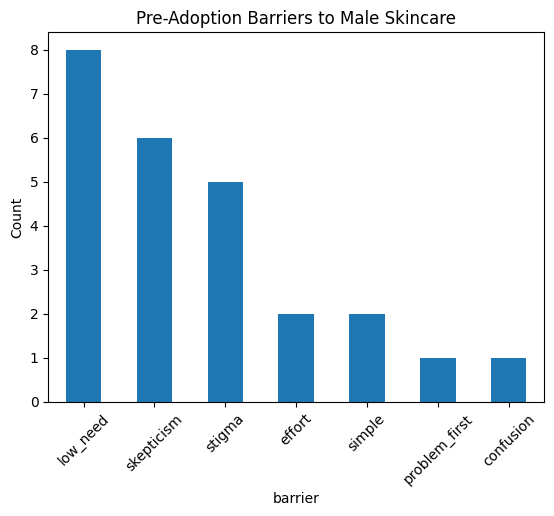
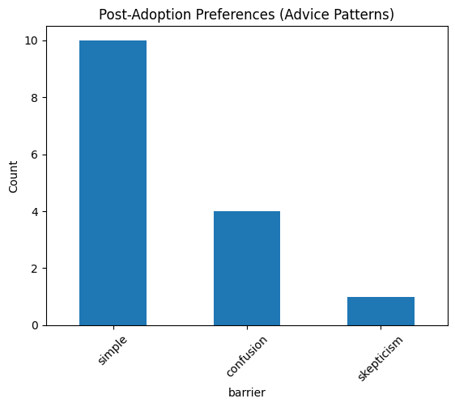
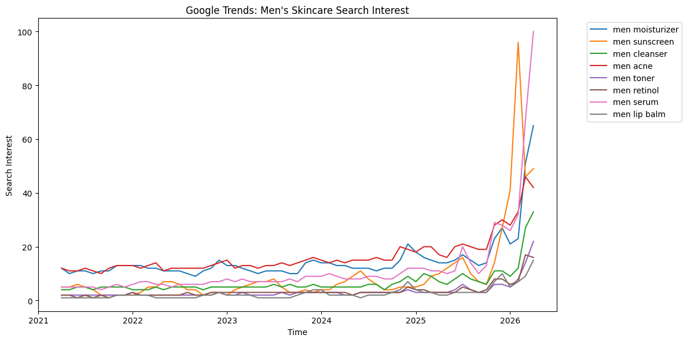

# Where Men Start: Exploring Barriers to Male Skincare Adoption

A student data project combining Reddit sentiment analysis and Google Trends search behavior to explore why male skincare adoption remains limited despite rising consumer interest.

> **Note:** This is an exploratory student project. The dataset is small and manually labeled, and findings should be interpreted as directional rather than statistically conclusive. I've tried to be transparent about limitations throughout.

---

## Research Question

What prevents men from adopting skincare routines, and how do they actually enter the category?

---

## Motivation

Men's skincare is a growing market, yet adoption rates remain low relative to search interest and media coverage. We wanted to understand whether the barrier is primarily psychological (stigma, skepticism), practical (effort, complexity), or informational (confusion, lack of perceived need) — and whether observed search behavior actually aligns with what men say online.

---

## Data

### 1. Reddit comments (manually labeled)

We collected Reddit comments from skincare-adjacent subreddits and manually labeled them into two stages:

- **Pre-adoption** — comments reflecting resistance, skepticism, or unfamiliarity with skincare
- **Post-adoption** — comments from users who have already started a routine

Pre-adoption barrier categories:

| Label | Description |
|-------|-------------|
| `low_need` | "I don't think I need it" |
| `skepticism` | Doubt about whether products actually work |
| `stigma` | Social or gender-related discomfort |
| `confusion` | Uncertainty about what to use or how |
| `effort` | Perceived time or complexity cost |
| `problem_first` | Entered skincare to solve a specific problem |
| `simple` | Preference for minimal routines |

**Limitation:** The dataset is small and hand-labeled by two people, which introduces subjectivity. Labels reflect my interpretation of comments and should not be treated as ground truth. A larger dataset with multiple annotators would improve reliability.

### 2. Google Trends

We tracked monthly search interest from 2021 to 2026 for the following terms:

- men moisturizer
- men sunscreen
- men cleanser
- men acne
- men toner
- men retinol
- men serum
- men lip balm

**Limitation:** Google Trends returns relative search interest (indexed to 100), not absolute search volume. Comparisons across terms are approximate.

---

## Method

### Reddit analysis

1. Collected comments manually from relevant subreddits
2. Labeled each comment as `pre_adoption` or `post_adoption`
3. Within pre-adoption comments, assigned one or more barrier categories
4. Counted category frequency and visualized distribution

### Google Trends analysis

1. Downloaded monthly search interest data for all 8 terms
2. Cleaned and reshaped data using pandas
3. Plotted time-series trends to compare steady product demand against spike-driven exploration

---

## Key Findings

### 1. Pre-adoption resistance is driven more by low perceived need than by complexity

In the labeled dataset, the most common barrier was not confusion or effort. It was simply not believing skincare was necessary. Men appear to opt out before they even consider the complexity of routines.

### 2. Simplicity becomes a priority after adoption, not before

Post-adoption comments strongly favored minimal routines and basic products. Once users are in the category, friction reduction matters. Before adoption, the issue is belief, not routine length.

### 3. Search behavior and stated attitudes point in different directions

Google Trends shows strong and rising interest in moisturizer, sunscreen, acne solutions, and, most surprisingly, serum, even while Reddit discussion reflects skepticism and low perceived need. This gap is one of the more interesting tensions in the data.

---

## Core Insight

Male skincare adoption appears to be shaped by a behavioral gap:

- **Stated attitude:** low need, skepticism, resistance
- **Observed behavior:** problem-driven search and growing product exploration

Men do not tend to proactively identify as skincare users. Based on the collected data, they seem to enter the category when a specific problem appears, most commonly acne or dryness, and then prefer the simplest possible solution from that point forward.

---

## Strategic Implication

If this pattern holds more broadly, the opportunity for brands is not primarily about simplifying routines.

The more significant opportunity may be creating **low-friction entry points** that:

- address a visible, felt problem directly
- establish trust quickly (ingredients, outcomes, not brand language)
- explain product purpose clearly rather than assuming familiarity
- minimize perceived effort at the point of first contact

---

## Limitations and Next Steps

We want to be upfront about what this project is and isn't:

- The Reddit dataset is small (hand-labeled comments) and may not be representative
- Google Trends data captures interest, not purchase intent or actual behavior
- Barrier labels reflect the interpretation and have not been validated by external annotators

If we were to extend this project, the natural next steps would be:

1. Expanding the Reddit dataset using the Pushshift API or a larger manual collection
2. Adding review data (e.g. Sephora or Kaggle beauty datasets) to test whether confusion shows up differently in product-level feedback
3. Comparing search trends against actual sales data if accessible

---

## Visuals

**Pre-Adoption Barriers**


**Post-Adoption Preferences**


**Google Trends Search Interest (2021–2026)**


---

## Files

```
├── data/
│   └── mens_skincare_reddit_starter_dataset.csv
├── notebooks/
│   ├── reddit_barriers_analysis.py
│   └── google_trends_analysis.py
├── outputs/
│   ├── pre_adoption_barriers.png
│   ├── post_adoption_patterns.png
│   └── trends_chart.png
└── README.md
```

---

## How to Run

```bash
pip install -r requirements.txt
python notebooks/reddit_barriers_analysis.py
python notebooks/google_trends_analysis.py
```

---

